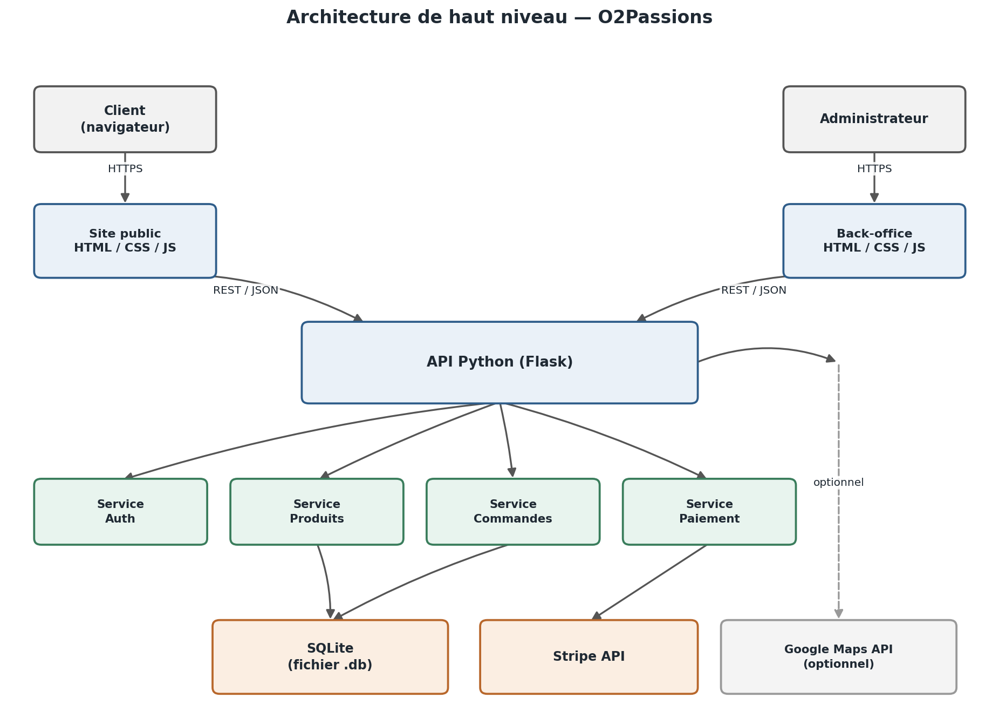
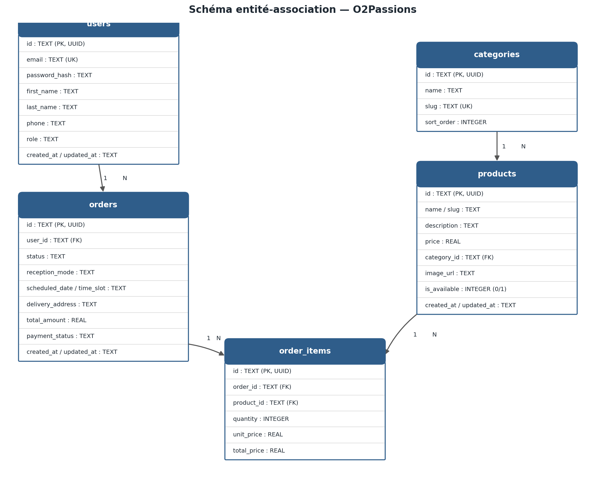
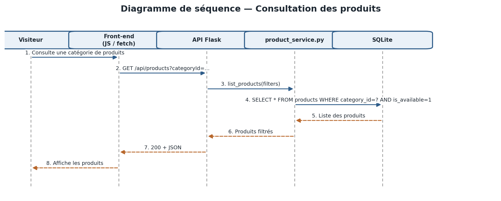
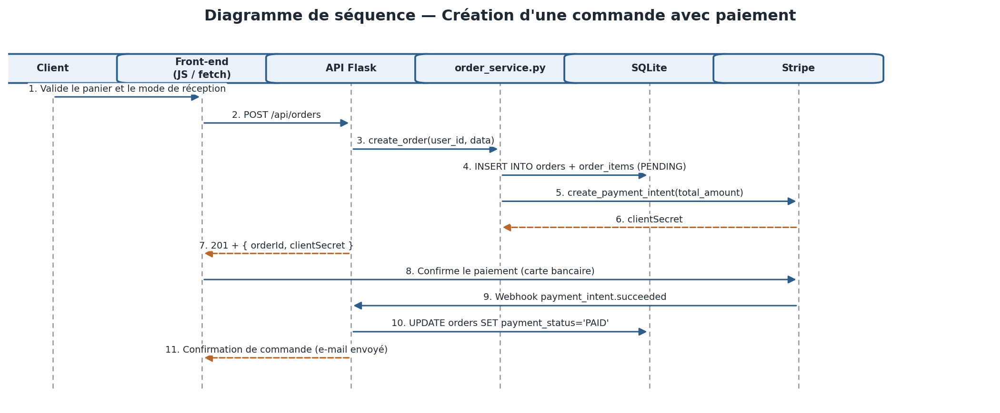
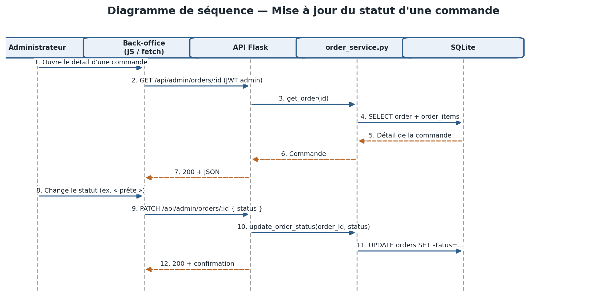

# Documentation technique — Site web O2Passions (boulangerie-pâtisserie)

**Projet :** O2Passions — Site web d'une boulangerie-pâtisserie permettant de présenter les produits, informer sur les horaires et la localisation, et passer des commandes en ligne (retrait en boutique ou livraison locale).

**Objectif du MVP :** Offrir une vitrine numérique claire et permettre la prise de commande simple, tout en restant facile à maintenir et à faire évoluer.

**Stack technique de cette version :** HTML / CSS / JavaScript (front-end), Python avec Flask (back-end), SQLite (base de données).

## Sommaire

1. [Présentation du projet](#1-présentation-du-projet)
2. [User Stories et priorisation](#2-user-stories-et-priorisation)
3. [Maquettes des écrans principaux](#3-maquettes-des-écrans-principaux)
4. [Architecture du système](#4-architecture-du-système)
5. [Composants, classes et conception de la base de données](#5-composants-classes-et-conception-de-la-base-de-données)
6. [Conception de la base de données](#6-conception-de-la-base-de-données)
7. [Diagrammes de séquence](#7-diagrammes-de-séquence)
8. [APIs externes et spécifications des APIs internes](#8-apis-externes-et-spécifications-des-apis-internes)
9. [Stratégie SCM et QA](#9-stratégie-scm-et-qa)
10. [Justifications techniques](#10-justifications-techniques)
11. [Sécurité et évolutions futures](#11-sécurité-et-évolutions-futures)

---

## 1. Présentation du projet

### 1.1 Contexte

O2Passions est une boulangerie-pâtisserie qui souhaite :

- Présenter ses produits (pains, viennoiseries, pâtisseries, traiteur, etc.).
- Informer sur les horaires, l'adresse et les coordonnées.
- Permettre aux clients de commander en ligne pour :
  - Retrait en boutique.
  - Livraison locale (périmètre limité).

Le site doit être :

- Responsive (mobile, tablette, desktop).
- Simple à utiliser pour les clients.
- Facile à administrer pour l'équipe (mise à jour des produits, gestion des commandes).

### 1.2 Types d'utilisateurs

| Type d'utilisateur | Description |
|---|---|
| Visiteur | Consulte le site, les produits, les horaires et la localisation. |
| Client connecté | Crée un compte, passe et suit ses commandes, gère son profil. |
| Administrateur / Gérant | Gère le catalogue produits, les commandes, les horaires et le contenu du site. |

### 1.3 Périmètre du MVP

**Inclus :**

- Vitrine des produits par catégories.
- Pages d'information (À propos, Horaires & Localisation, Contact).
- Compte client (création, connexion, profil).
- Panier et commande en ligne.
- Paiement en ligne (carte bancaire).
- Back-office pour gérer produits et commandes.
- Tests automatisés et déploiement continu.

**Hors périmètre (pour une version ultérieure) :**

- Programme de fidélité avancé.
- Abonnements récurrents.
- Application mobile native.
- Chat en direct avec le personnel.
- Multi-boutiques.

---

## 2. User Stories et priorisation

Les User Stories sont rédigées selon le format : *« En tant que [type d'utilisateur], je veux [action], afin de [objectif]. »*

### 2.1 Must Have — Indispensable

**US-01 — Consulter la vitrine et les produits**

> En tant que visiteur, je veux consulter la liste des produits par catégorie, afin de découvrir l'offre de la boulangerie.

Critères d'acceptation :
- Les produits sont organisés par catégories (pains, viennoiseries, pâtisseries, etc.).
- Chaque produit affiche : nom, description courte, prix, image, disponibilité.
- La page est lisible sur mobile et desktop.

**US-02 — Voir les horaires et la localisation**

> En tant que visiteur, je veux voir les horaires d'ouverture et l'adresse de la boutique, afin de savoir quand et où me rendre.

Critères d'acceptation :
- Une page dédiée affiche les horaires par jour.
- L'adresse, le numéro de téléphone et un lien vers la carte (Google Maps) sont visibles.
- Les horaires peuvent être mis à jour par l'administrateur.

**US-03 — Créer un compte client**

> En tant que visiteur, je veux créer un compte client, afin de pouvoir commander en ligne et suivre mes commandes.

Critères d'acceptation :
- Formulaire d'inscription : nom, prénom, e-mail, mot de passe, téléphone (optionnel).
- Validation de l'e-mail (format et unicité).
- Mot de passe conforme aux règles de sécurité.
- Confirmation par e-mail (optionnelle dans le MVP, mais prévue).

**US-04 — Se connecter / se déconnecter**

> En tant que client, je veux me connecter et me déconnecter, afin d'accéder à mon espace personnel et à mes commandes.

Critères d'acceptation :
- Connexion par e-mail et mot de passe.
- Gestion de session sécurisée (JWT ou session serveur).
- Redirection vers le tableau de bord après connexion.
- Déconnexion claire et fonctionnelle.

**US-05 — Ajouter des produits au panier**

> En tant que client connecté ou non (selon choix), je veux ajouter des produits au panier, afin de préparer ma commande.

Critères d'acceptation :
- Sélection de la quantité par produit.
- Affichage du panier avec récapitulatif (produits, quantités, prix total).
- Possibilité de modifier ou supprimer un article du panier.
- Le panier est conservé entre les pages (session ou compte).

**US-06 — Passer une commande**

> En tant que client connecté, je veux passer une commande en ligne, afin de réserver mes produits pour retrait ou livraison.

Critères d'acceptation :
- Choix du mode de réception : retrait en boutique ou livraison.
- Sélection de la date et de l'horaire de retrait/livraison (plages définies).
- Saisie ou confirmation de l'adresse de livraison si applicable.
- Récapitulatif de la commande avant paiement.
- Paiement sécurisé par carte bancaire.
- Génération d'un numéro de commande et envoi d'un e-mail de confirmation.

**US-07 — Suivre ses commandes**

> En tant que client connecté, je veux consulter l'historique et le statut de mes commandes, afin de savoir où en est ma commande.

Critères d'acceptation :
- Liste des commandes passées par le client.
- Détail de chaque commande : produits, total, mode de réception, date, statut.
- Statuts possibles : en préparation, prête, en livraison, terminée, annulée.

**US-08 — Gérer le catalogue produits (back-office)**

> En tant qu'administrateur, je veux ajouter, modifier et désactiver des produits, afin de maintenir le catalogue à jour.

Critères d'acceptation :
- Création d'un produit : nom, description, prix, catégorie, image, disponibilité.
- Modification des informations d'un produit.
- Activation/désactivation d'un produit (sans suppression).
- Gestion des catégories.

**US-09 — Gérer les commandes (back-office)**

> En tant qu'administrateur, je veux consulter et mettre à jour le statut des commandes, afin de gérer la production et la livraison.

Critères d'acceptation :
- Liste des commandes avec filtres (statut, date, mode de réception).
- Détail d'une commande.
- Changement de statut (ex. « en préparation » → « prête »).
- Possibilité d'annuler une commande avec motif.

### 2.2 Should Have — Important

**US-10 — Code promotionnel**
> En tant que client, je veux saisir un code promotionnel lors de la commande, afin de bénéficier d'une réduction.

**US-11 — Favoris / produits préférés**
> En tant que client, je veux marquer des produits comme favoris, afin de les retrouver facilement.

**US-12 — Avis et notes sur les produits**
> En tant que client, je veux laisser un avis et une note sur un produit après achat, afin de partager mon expérience.

### 2.3 Could Have — Souhaitable

**US-13 — Pré-commande pour événements**
> En tant que client, je veux commander un gâteau personnalisé pour un événement, afin de préciser mes besoins (texte, décor, etc.).

**US-14 — Newsletter**
> En tant que visiteur, je veux m'inscrire à la newsletter, afin de recevoir les actualités et promotions.

### 2.4 Won't Have — Hors périmètre du MVP

**US-15 — Programme de fidélité complet**
> En tant que client, je veux cumuler des points et les convertir en avantages, afin de bénéficier d'un programme de fidélité.

Cette fonctionnalité est reportée à une version ultérieure.

---

## 3. Maquettes des écrans principaux

Le MVP inclut une interface client (site public) et une interface administrateur (back-office).

### 3.1 Page d'accueil (client)

```text
+----------------------------------------------------------+
| O2Passions                         [Panier] [Compte]      |
+----------------------------------------------------------+
| [Bannière : image de vitrine / spécialités]              |
+----------------------------------------------------------+
| Nos catégories                                           |
| [Pains] [Viennoiseries] [Pâtisseries] [Traiteur] [...]   |
+----------------------------------------------------------+
| Produits phares                                          |
| [Carte produit 1] [Carte produit 2] [Carte produit 3]    |
+----------------------------------------------------------+
| Horaires & Localisation                                  |
| Ouvert du mardi au dimanche, 7h-19h                       |
| 12 rue du Four, 75000 Ville                               |
| [Voir sur la carte]                                       |
+----------------------------------------------------------+
| À propos                                                 |
| Court texte sur l'histoire et les valeurs.                |
+----------------------------------------------------------+
| Footer : liens légaux, CGV, contact, réseaux sociaux      |
+----------------------------------------------------------+
```

### 3.2 Page catégorie / liste des produits

```text
+----------------------------------------------------------+
| O2Passions                         [Panier] [Compte]      |
+----------------------------------------------------------+
| Pains                                                     |
+----------------------------------------------------------+
| Filtres : [Tous] [Sans gluten] [Au levain] [...]          |
+----------------------------------------------------------+
| [Produit] [Produit] [Produit] [Produit]                   |
| - Image                                                   |
| - Nom                                                      |
| - Prix                                                     |
| - Bouton "Ajouter au panier"                               |
+----------------------------------------------------------+
```

### 3.3 Détail d'un produit

```text
+----------------------------------------------------------+
| O2Passions                         [Panier] [Compte]      |
+----------------------------------------------------------+
| [Image grande]                                            |
|                                                            |
| Nom du produit                                             |
| Description complète                                       |
| Prix : 3,50 EUR                                             |
|                                                            |
| Quantité : [ - ] [ 1 ] [ + ]                                |
| [ Ajouter au panier ]                                       |
|                                                            |
| Autres produits de la catégorie                             |
+----------------------------------------------------------+
```

### 3.4 Panier

```text
+----------------------------------------------------------+
| Mon panier                                                |
+----------------------------------------------------------+
| Produit            | Qté | Prix unit. | Total | Suppr.    |
| Baguette tradition |  2  |   1,20 EUR |2,40 EUR|   [X]    |
| Éclair chocolat    |  1  |   3,50 EUR |3,50 EUR|   [X]    |
+----------------------------------------------------------+
| Total : 5,90 EUR                                            |
| [ Continuer mes achats ]   [ Commander ]                    |
+----------------------------------------------------------+
```

### 3.5 Checkout (récapitulatif et paiement)

```text
+----------------------------------------------------------+
| Commander                                                 |
+----------------------------------------------------------+
| Récapitulatif de la commande                               |
| - Liste des produits                                       |
| - Total                                                     |
+----------------------------------------------------------+
| Mode de réception                                          |
| [ Retrait en boutique ]  [ Livraison ]                      |
+----------------------------------------------------------+
| Date et heure                                              |
| [Sélecteur de date] [Sélecteur d'horaire]                    |
+----------------------------------------------------------+
| Adresse (si livraison)                                      |
| [Formulaire d'adresse]                                       |
+----------------------------------------------------------+
| Paiement                                                    |
| [Payer par carte]                                            |
+----------------------------------------------------------+
| [ Confirmer la commande ]                                    |
+----------------------------------------------------------+
```

### 3.6 Espace client (mes commandes)

```text
+----------------------------------------------------------+
| Mon espace                                                |
+----------------------------------------------------------+
| Mes informations                                           |
| Nom, prénom, e-mail, téléphone                               |
| [Modifier]                                                   |
+----------------------------------------------------------+
| Mes commandes                                               |
| Date | N° commande | Total | Statut | [Voir détail]          |
+----------------------------------------------------------+
```

### 3.7 Back-office — Liste des produits

```text
+----------------------------------------------------------+
| Administration O2Passions                                  |
+----------------------------------------------------------+
| Produits                                                    |
+----------------------------------------------------------+
| [Ajouter un produit]                                         |
+----------------------------------------------------------+
| Nom | Catégorie | Prix | Statut | Actions                     |
| Baguette | Pains | 1,20 EUR | Actif | [Éditer] [Désactiver]   |
+----------------------------------------------------------+
```

### 3.8 Back-office — Détail d'une commande

```text
+----------------------------------------------------------+
| Commande #1234                                             |
+----------------------------------------------------------+
| Client : Alice Martin                                        |
| Date : 07/09/2026 10:30                                       |
| Mode : Livraison                                              |
| Statut : [En préparation v]                                    |
+----------------------------------------------------------+
| Produits                                                     |
| - 2 x Baguette tradition                                      |
| - 1 x Éclair chocolat                                          |
+----------------------------------------------------------+
| Adresse de livraison                                          |
| 10 avenue des Champs, 75000 Ville                               |
+----------------------------------------------------------+
| [Enregistrer le statut]  [Annuler la commande]                  |
+----------------------------------------------------------+
```

---

## 4. Architecture du système

### 4.1 Technologies retenues

| Couche | Technologie | Rôle |
|---|---|---|
| Front-end client | HTML5 + CSS3 + JavaScript (vanilla) | Site public : pages statiques, appels `fetch()` vers l'API. |
| Front-end admin | HTML5 + CSS3 + JavaScript (vanilla) | Back-office pour gérants, mêmes technologies que le site public. |
| Back-end API | Python avec Flask | API REST, logique métier, validation des données. |
| Base de données | SQLite (module `sqlite3` de Python) | Stockage des produits, commandes, utilisateurs dans un fichier `.db`. |
| Authentification | JWT (ex. `PyJWT`) ou sessions Flask | Gestion des connexions clients et admin. |
| Paiement | Stripe (bibliothèque `stripe` pour Python) | Paiement par carte bancaire. |
| Hébergement | Fichiers statiques servis par Flask (ou Nginx) + Render / PythonAnywhere / Railway pour l'API | Déploiement simple, adapté à un commerce local. |
| Tests | `pytest` (back-end), `Jest` (fonctions JS), Playwright | Tests unitaires, intégration, end-to-end. |
| CI/CD | GitHub Actions | Build, tests, déploiement automatique. |

### 4.2 Diagramme d'architecture de haut niveau



### 4.3 Flux de données principaux

1. Le client navigue sur les pages HTML/CSS/JS statiques.
2. Le JavaScript du front-end appelle l'API via `fetch()` pour :
   - Récupérer les produits et catégories.
   - Créer / mettre à jour le panier.
   - Passer une commande.
3. L'API Flask vérifie l'authentification (JWT).
4. L'API interagit avec la base SQLite pour lire/écrire les données.
5. Pour le paiement, l'API communique avec Stripe.
6. Le back-office (mêmes technologies HTML/CSS/JS) appelle les mêmes endpoints API avec des droits admin.

> **Note sur SQLite :** SQLite est un moteur de base de données embarqué dans un simple fichier, sans serveur dédié. Il est bien adapté à un MVP à trafic modéré (une boutique locale). Le support des clés étrangères doit être activé explicitement (`PRAGMA foreign_keys = ON`) et, en cas de forte croissance du trafic ou de besoin d'accès concurrents en écriture plus intensifs, une migration vers PostgreSQL ou MySQL pourra être envisagée (cf. section 11 — Évolutions possibles).

---

## 5. Composants, classes et conception de la base de données

### 5.1 Principales pages et scripts front-end (client)

Pages HTML (statiques, servies telles quelles) :

- `index.html` : page d'accueil (bannière, catégories, produits phares, horaires).
- `categorie.html` : liste des produits d'une catégorie (avec filtres).
- `produit.html` : détail d'un produit.
- `panier.html` : affichage et gestion du panier.
- `checkout.html` : formulaire de commande et paiement.
- `compte.html` : profil et historique des commandes.
- `connexion.html` / `inscription.html` : authentification.

Scripts JavaScript (un fichier par responsabilité, importés dans les pages concernées) :

- `js/api.js` : centralise les appels `fetch()` vers l'API (URL de base, gestion du token JWT, gestion des erreurs).
- `js/auth.js` : logique des formulaires de connexion / inscription.
- `js/products.js` : chargement et affichage des produits et catégories.
- `js/cart.js` : gestion du panier (ajout, modification, suppression, persistance en `localStorage` avant commande).
- `js/checkout.js` : récapitulatif de commande et intégration du paiement Stripe (Stripe.js).
- `js/account.js` : affichage du profil et de l'historique des commandes.
- `css/style.css` : feuille de style commune (mise en page responsive, variables CSS pour les couleurs et typographies).

### 5.2 Principales pages et scripts du back-office

- `admin/index.html` : tableau de bord admin.
- `admin/produits.html` : liste et formulaire de gestion des produits.
- `admin/commandes.html` : liste et détail des commandes.
- `admin/parametres.html` : horaires, informations de la boutique.
- `admin/js/admin-products.js` : appels API et interactions pour la gestion des produits.
- `admin/js/admin-orders.js` : appels API et interactions pour la gestion des commandes.

### 5.3 Modules et classes back-end (Python / Flask)

**Modèles (`models/`)**

**User** (`models/user.py`)
- Attributs : `id`, `email`, `password_hash`, `first_name`, `last_name`, `phone`, `role`, `created_at`, `updated_at`.
- Méthodes : `create_user()`, `find_by_email()`, `verify_password()`, `generate_token()`.

**Product** (`models/product.py`)
- Attributs : `id`, `name`, `slug`, `description`, `price`, `category_id`, `image_url`, `is_available`, `created_at`, `updated_at`.
- Méthodes : `create()`, `find_all()`, `find_by_id()`, `update()`, `delete()`, `find_by_category()`.

**Category** (`models/category.py`)
- Attributs : `id`, `name`, `slug`, `sort_order`.
- Méthodes : `create()`, `find_all()`, `find_by_id()`.

**Order** (`models/order.py`)
- Attributs : `id`, `user_id`, `status`, `reception_mode`, `scheduled_date`, `scheduled_time_slot`, `delivery_address`, `total_amount`, `payment_status`, `created_at`, `updated_at`.
- Méthodes : `create()`, `find_by_id()`, `find_by_user_id()`, `find_all_for_admin()`, `update_status()`, `cancel()`.

**OrderItem** (`models/order_item.py`)
- Attributs : `id`, `order_id`, `product_id`, `quantity`, `unit_price`, `total_price`.
- Méthodes : `create()`, `find_by_order_id()`.

**Services (`services/`) — logique métier**

**auth_service.py**
- Fonctions : `register()`, `login()`, `validate_token()`, `refresh_token()` (optionnel).

**product_service.py**
- Fonctions : `list_products(filters)`, `get_product(id)`, `create_product(data)`, `update_product(id, data)`, `toggle_availability(id)`.

**order_service.py**
- Fonctions : `create_order(user_id, data)`, `get_order(id)`, `get_user_orders(user_id)`, `update_order_status(order_id, status)`, `cancel_order(order_id, reason)`.

**payment_service.py**
- Fonctions : `create_payment_intent(amount, currency)`, `confirm_payment(payment_intent_id)`, `handle_webhook(event)` (intégration de la bibliothèque `stripe`).

### 5.4 Organisation du projet (proposition)

```text
o2passions/
|-- backend/
|   |-- app.py                  # point d'entree Flask, enregistrement des blueprints
|   |-- database.py             # connexion SQLite, initialisation du schema
|   |-- models/
|   |   |-- user.py
|   |   |-- product.py
|   |   |-- category.py
|   |   |-- order.py
|   |   `-- order_item.py
|   |-- services/
|   |   |-- auth_service.py
|   |   |-- product_service.py
|   |   |-- order_service.py
|   |   `-- payment_service.py
|   |-- routes/
|   |   |-- auth_routes.py      # blueprint /api/auth
|   |   |-- product_routes.py   # blueprint /api/products, /api/categories
|   |   |-- order_routes.py     # blueprint /api/orders, /api/cart
|   |   `-- admin_routes.py     # blueprint /api/admin
|   |-- schema.sql              # script de creation des tables SQLite
|   `-- tests/
|       |-- test_auth.py
|       |-- test_products.py
|       `-- test_orders.py
`-- frontend/
    |-- index.html
    |-- categorie.html
    |-- produit.html
    |-- panier.html
    |-- checkout.html
    |-- compte.html
    |-- connexion.html
    |-- inscription.html
    |-- admin/
    |   |-- index.html
    |   |-- produits.html
    |   |-- commandes.html
    |   `-- js/
    |       |-- admin-products.js
    |       `-- admin-orders.js
    |-- css/
    |   `-- style.css
    `-- js/
        |-- api.js
        |-- auth.js
        |-- products.js
        |-- cart.js
        |-- checkout.js
        `-- account.js
```

---

## 6. Conception de la base de données

### 6.1 Schéma relationnel (SQLite)

> SQLite est dynamiquement typé : les types déclarés ci-dessous sont des conventions respectées par le schéma (`schema.sql`), mais SQLite n'impose pas de longueur maximale sur `TEXT`. Les identifiants sont générés côté application (ex. `uuid4()` en Python) et stockés en `TEXT`. Les booléens sont stockés en `INTEGER` (0 = faux, 1 = vrai). Les dates sont stockées en `TEXT` au format ISO 8601 (ex. `2026-09-15`). Le support des clés étrangères doit être activé avec `PRAGMA foreign_keys = ON;` à chaque connexion.

**Table `users`**

| Colonne | Type | Contraintes |
|---|---|---|
| id | TEXT | PK (UUID) |
| email | TEXT | Unique, obligatoire |
| password_hash | TEXT | Obligatoire |
| first_name | TEXT | Obligatoire |
| last_name | TEXT | Obligatoire |
| phone | TEXT | Facultatif |
| role | TEXT | CUSTOMER, ADMIN |
| created_at | TEXT | Obligatoire (ISO 8601) |
| updated_at | TEXT | Obligatoire (ISO 8601) |

**Table `categories`**

| Colonne | Type | Contraintes |
|---|---|---|
| id | TEXT | PK (UUID) |
| name | TEXT | Obligatoire |
| slug | TEXT | Unique |
| sort_order | INTEGER | Facultatif (ordre d'affichage) |

**Table `products`**

| Colonne | Type | Contraintes |
|---|---|---|
| id | TEXT | PK (UUID) |
| name | TEXT | Obligatoire |
| slug | TEXT | Unique |
| description | TEXT | Facultatif |
| price | REAL | Obligatoire |
| category_id | TEXT | FK → categories.id |
| image_url | TEXT | Facultatif |
| is_available | INTEGER | Défaut 1 (0 = indisponible) |
| created_at | TEXT | Obligatoire (ISO 8601) |
| updated_at | TEXT | Obligatoire (ISO 8601) |

**Table `orders`**

| Colonne | Type | Contraintes |
|---|---|---|
| id | TEXT | PK (UUID) |
| user_id | TEXT | FK → users.id |
| status | TEXT | Obligatoire |
| reception_mode | TEXT | PICKUP, DELIVERY |
| scheduled_date | TEXT | Obligatoire (date ISO 8601) |
| scheduled_time_slot | TEXT | Obligatoire |
| delivery_address | TEXT | Obligatoire si livraison |
| total_amount | REAL | Obligatoire |
| payment_status | TEXT | PENDING, PAID, FAILED, REFUNDED |
| created_at | TEXT | Obligatoire (ISO 8601) |
| updated_at | TEXT | Obligatoire (ISO 8601) |

**Table `order_items`**

| Colonne | Type | Contraintes |
|---|---|---|
| id | TEXT | PK (UUID) |
| order_id | TEXT | FK → orders.id |
| product_id | TEXT | FK → products.id |
| quantity | INTEGER | Obligatoire, > 0 |
| unit_price | REAL | Obligatoire |
| total_price | REAL | Obligatoire |

### 6.2 Diagramme entité-association



### 6.3 Règles d'intégrité

- Un produit appartient à une et une seule catégorie.
- Une commande appartient à un et un seul utilisateur.
- Les lignes de commande (`order_items`) référencent une commande et un produit existants.
- Le prix et la quantité sont toujours positifs.
- La suppression d'un produit n'efface pas les lignes de commande historiques (pas de `ON DELETE CASCADE` sur `products` → `order_items`, ou utilisation de soft delete).
- Le contrôle des clés étrangères doit être activé à chaque ouverture de connexion SQLite (`PRAGMA foreign_keys = ON;`), sans quoi SQLite ne les fait pas respecter par défaut.

---

## 7. Diagrammes de séquence

### 7.1 Consultation des produits



### 7.2 Création d'une commande avec paiement



Si le paiement échoue ou si le webhook Stripe signale un échec, l'API met la commande à jour avec `payment_status = FAILED` et aucune confirmation n'est envoyée au client.

### 7.3 Mise à jour du statut d'une commande (back-office)



---

## 8. APIs externes et spécifications des APIs internes

### 8.1 APIs externes

| API | Utilisation | Justification |
|---|---|---|
| Stripe | Paiement par carte bancaire (CB). | Solution éprouvée, documentation complète, conformité PCI déléguée. |
| Google Maps (optionnel) | Affichage de la localisation et calcul d'itinéraire. | Améliore l'expérience client pour se rendre en boutique. |
| Service d'envoi d'e-mails (ex. SendGrid, Mailgun) | Envoi des confirmations de commande, réinitialisation de mot de passe. | Évite de gérer un serveur SMTP, meilleure délivrabilité. |

Dans le MVP, Stripe est indispensable. Google Maps et le service d'e-mails peuvent être intégrés progressivement.

### 8.2 Format général des réponses API

**Réponse réussie**

```json
{
  "data": {},
  "message": "Operation completed successfully"
}
```

**Réponse d'erreur**

```json
{
  "error": {
    "code": "VALIDATION_ERROR",
    "message": "Invalid input data",
    "details": []
  }
}
```

Codes HTTP principaux : `200`, `201`, `400`, `401`, `403`, `404`, `409`, `500`.

### 8.3 Endpoints publics (client)

**Authentification**

| Méthode | URL | Entrée | Sortie |
|---|---|---|---|
| POST | `/api/auth/register` | `{ firstName, lastName, email, password, phone? }` | Utilisateur créé + token |
| POST | `/api/auth/login` | `{ email, password }` | Token + profil utilisateur |
| GET | `/api/auth/me` | Header `Authorization: Bearer <token>` | Profil utilisateur connecté |

**Produits et catégories**

| Méthode | URL | Entrée | Sortie |
|---|---|---|---|
| GET | `/api/categories` | — | Liste des catégories |
| GET | `/api/products` | Query params : `categoryId?`, `search?`, `available?` | Liste des produits |
| GET | `/api/products/:slug` | — | Détail d'un produit |

**Panier** (si géré côté serveur — peut aussi être géré côté client en JavaScript via `localStorage`, sans endpoints dédiés)

| Méthode | URL |
|---|---|
| GET | `/api/cart` |
| POST | `/api/cart/items` |
| PATCH | `/api/cart/items/:itemId` |
| DELETE | `/api/cart/items/:itemId` |

**Commandes**

| Méthode | URL | Entrée | Sortie |
|---|---|---|---|
| POST | `/api/orders` | `{ items: [{ productId, quantity }], receptionMode, scheduledDate, scheduledTimeSlot, deliveryAddress? }` | `{ orderId, clientSecret }` pour le paiement |
| GET | `/api/orders` | — | Liste des commandes de l'utilisateur connecté |
| GET | `/api/orders/:id` | — | Détail d'une commande |
| POST | `/api/orders/:id/confirm-payment` | `{ paymentIntentId }` | Confirmation de paiement |

### 8.4 Endpoints administrateur (back-office)

Tous protégés et réservés aux utilisateurs avec `role = ADMIN`.

| Méthode | URL | Entrée / Query | Sortie |
|---|---|---|---|
| GET | `/api/admin/products` | — | Liste des produits |
| POST | `/api/admin/products` | Données produit | Produit créé |
| GET | `/api/admin/products/:id` | — | Détail produit |
| PATCH | `/api/admin/products/:id` | Champs à modifier | Produit modifié |
| DELETE | `/api/admin/products/:id` | — | Suppression (ou soft delete) |
| GET | `/api/admin/orders` | `status?`, `receptionMode?`, `dateFrom?`, `dateTo?` | Liste des commandes |
| GET | `/api/admin/orders/:id` | — | Détail d'une commande |
| PATCH | `/api/admin/orders/:id` | `{ status?, paymentStatus? }` | Commande modifiée |
| POST | `/api/admin/orders/:id/cancel` | `{ reason }` | Confirmation d'annulation |

---

## 9. Stratégie SCM et QA

### 9.1 SCM (Source Control Management)

**Outil :** Git + GitHub.

**Stratégie de branches :**

```text
main
`-- develop
    |-- feature/auth
    |-- feature/products
    |-- feature/orders
    |-- feature/admin
    `-- fix/payment-webhook
```

| Branche | Utilisation |
|---|---|
| main | Version stable en production. |
| develop | Intégration des fonctionnalités validées. |
| feature/* | Développement d'une fonctionnalité isolée. |
| fix/* | Corrections de bugs. |
| release/* | Préparation d'une version (optionnel). |

**Règles de contribution :**

- Pas de commit direct sur `main` ni `develop`.
- Chaque fonctionnalité sur une branche `feature/*`.
- Pull Request obligatoire avec :
  - Description claire.
  - Tests associés.
  - Au moins une revue de code.
- CI obligatoire : lint, tests unitaires et d'intégration.
- Secrets et clés API dans des variables d'environnement, jamais dans Git.

### 9.2 QA (Quality Assurance)

**Types de tests :**

| Type | Objectif | Outils |
|---|---|---|
| Tests unitaires back-end | Fonctions, services, accès aux données. | `pytest` |
| Tests unitaires front-end | Fonctions JavaScript isolées (panier, calculs, formatage). | Jest (mode navigateur simulé / jsdom) |
| Tests d'intégration API | Endpoints Flask, validation, erreurs, base SQLite de test. | `pytest` + `requests` (ou le client de test intégré à Flask) |
| Tests end-to-end | Parcours complets (commande, paiement test). | Playwright |
| Tests manuels | Validation ergonomique et cas limites. | Environnement staging |
| Analyse statique | Qualité du code, règles de style. | `flake8` / `black` (Python), ESLint (JavaScript) |

**Couverture minimale cible (MVP) :**

- Services métier (auth, produits, commandes, paiement).
- Routes Flask principales.
- Fonctions JavaScript critiques (panier, checkout, validation de formulaire de commande).

**Pipeline CI/CD (GitHub Actions) :**

1. Déclenché à chaque push / PR.
2. Installation des dépendances (`pip install -r requirements.txt`, dépendances JS si besoin).
3. Lint (`flake8`, ESLint) et vérification du formatage (`black --check`).
4. Tests unitaires et d'intégration (`pytest`, tests JS).
5. Initialisation d'une base SQLite de test (`schema.sql`) pour les tests d'intégration.
6. Déploiement automatique en staging sur `develop`.
7. Déploiement en production depuis `main` après validation.

**Environnements :**

- **Dev** : local, avec un fichier SQLite de développement (ex. `dev.db`).
- **Staging** : miroir de la production, base SQLite de test avec données fictives.
- **Production** : accessible aux clients, fichier SQLite avec sauvegardes régulières et monitoring.

---

## 10. Justifications techniques

**HTML / CSS / JavaScript (vanilla)**
- Pas de framework front-end à apprendre ni à maintenir : adapté à une équipe réduite ou à un projet pédagogique.
- Chargement rapide de pages simples (vitrine, catalogue, panier) sans complexité de build (bundler, transpileur).
- JavaScript natif (`fetch`, modules ES) suffit largement aux besoins d'un site de e-commerce de taille modeste.
- Limite à anticiper : sans framework, la gestion de l'état (panier, session) et la réutilisation de composants d'interface demandent plus de rigueur manuelle (ex. fonctions de rendu partagées en JS).

**Python avec Flask**
- Micro-framework simple à prendre en main, bien documenté, avec un écosystème mature.
- Structure flexible (blueprints) permettant de séparer routes, services et modèles comme décrit en section 5.
- Bibliothèques disponibles pour tous les besoins du MVP : `PyJWT` (authentification), `stripe` (paiement), `bcrypt`/`argon2-cffi` (hachage des mots de passe).
- Alternative possible : FastAPI, si une validation de données plus stricte (types Python, documentation OpenAPI automatique) est souhaitée.

**SQLite**
- Base de données embarquée dans un simple fichier, sans serveur à installer ni administrer : idéal pour un MVP et un budget limité.
- Suffisante pour le volume de données et de trafic d'une boulangerie locale.
- Le module `sqlite3` est inclus nativement dans Python, aucune dépendance supplémentaire n'est nécessaire pour démarrer.
- Limite à anticiper : les écritures concurrentes sont plus limitées que sur un serveur PostgreSQL/MySQL ; une migration sera à envisager en cas de forte croissance (plusieurs boutiques, forte affluence simultanée).

**Stripe pour le paiement**
- Conforme aux normes de sécurité (PCI DSS).
- Bibliothèque Python officielle (`stripe`) et bibliothèque JavaScript (Stripe.js / Stripe Elements) bien documentées.
- Gestion des webhooks pour synchroniser les statuts de paiement avec la base SQLite.

**Architecture en couches (back-end Flask)**
- Séparation claire entre :
  - Routes (blueprints Flask, équivalent des contrôleurs).
  - Services (logique métier, dans des modules Python dédiés).
  - Modèles (accès aux données SQLite).
- Facilite les tests unitaires (les services peuvent être testés indépendamment des routes HTTP), la maintenance et l'évolution du projet.

**CI/CD et tests automatisés**
- Détection rapide des régressions, y compris sur des scripts JavaScript non typés (d'où l'importance des tests unitaires JS).
- Déploiements plus sûrs et reproductibles.
- Réduction du risque d'erreurs humaines lors des mises en production.

**CI/CD et tests automatisés**
- Détection rapide des régressions, y compris sur des scripts JavaScript non typés (d'où l'importance des tests unitaires JS).
- Déploiements plus sûrs et reproductibles.
- Réduction du risque d'erreurs humaines lors des mises en production.

---

## 11. Sécurité et évolutions futures

### Sécurité

- HTTPS obligatoire.
- Hachage des mots de passe (ex. `bcrypt`, `argon2-cffi`).
- Validation stricte des entrées côté Flask (schéma de validation, ex. `marshmallow` ou `pydantic`).
- Utilisation systématique de requêtes SQL paramétrées (`?` avec `sqlite3`) pour éviter les injections SQL — ne jamais concaténer des chaînes dans les requêtes.
- Protection des routes admin par rôle (vérification du `role` décodé depuis le JWT).
- Limitation des tentatives de connexion (rate limiting, ex. `Flask-Limiter`).
- Gestion sécurisée des clés API et secrets (variables d'environnement, jamais dans le fichier SQLite ni dans Git).
- Sauvegardes régulières du fichier SQLite (copie planifiée, ex. tâche cron).
- Journalisation des erreurs et des actions sensibles.

### Évolutions possibles

- Migration vers PostgreSQL ou MySQL si le trafic ou les écritures concurrentes dépassent les limites confortables de SQLite.
- Programme de fidélité (points, offres personnalisées).
- Gestion des stocks en temps réel.
- Pré-commandes pour événements (gâteaux personnalisés).
- Intégration avec un système de caisse en magasin.
- Multi-boutiques avec gestion par point de vente.
- Évolution du front-end vanilla JS vers un framework (React, Vue) si l'interface se complexifie fortement.
- Application mobile ou PWA pour une expérience mobile améliorée.

---
